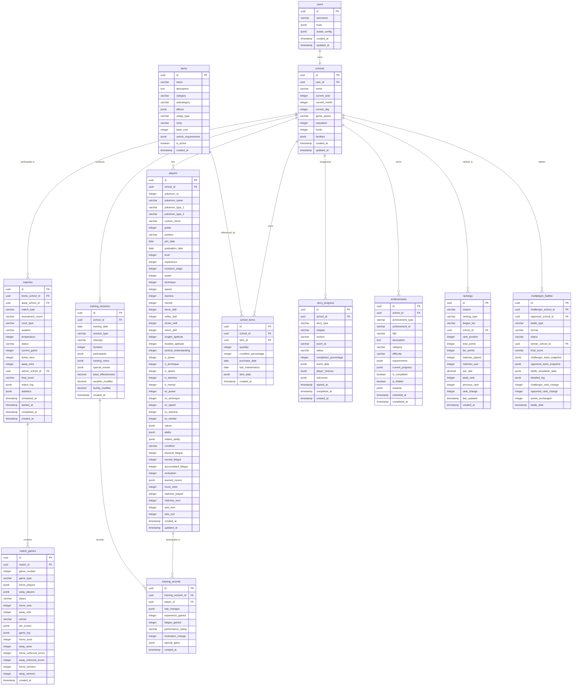

# ポケテニマスター データベース設計書

## 1. データベース概要

### 1.1 使用技術
- **データベース**: PostgreSQL 15+ (Supabase)
- **ORM**: Supabase JavaScript Client
- **認証**: Supabase Auth + Custom Logic
- **リアルタイム**: Supabase Realtime
- **ストレージ**: Supabase Storage

### 1.2 設計方針
- **正規化**: 第3正規形を基本とし、パフォーマンスを考慮して一部非正規化
- **セキュリティ**: Row Level Security (RLS) による厳密なアクセス制御
- **拡張性**: 将来的な機能追加に対応できる柔軟な設計
- **パフォーマンス**: 適切なインデックス設計とクエリ最適化

## 2. ER図



## 3. テーブル詳細設計

### 3.1 ユーザー・認証関連

#### 3.1.1 users テーブル
```sql
CREATE TABLE users (
  id UUID PRIMARY KEY DEFAULT gen_random_uuid(),
  username VARCHAR(50) NOT NULL UNIQUE,
  fruits JSONB NOT NULL CHECK (jsonb_array_length(fruits) = 4),
  avatar_config JSONB DEFAULT '{}',
  created_at TIMESTAMP WITH TIME ZONE DEFAULT NOW(),
  updated_at TIMESTAMP WITH TIME ZONE DEFAULT NOW(),
  
  -- 制約
  CONSTRAINT valid_username CHECK (LENGTH(username) >= 3 AND LENGTH(username) <= 50),
  CONSTRAINT valid_fruits_structure CHECK (
    fruits ? 'selection' AND 
    fruits ? 'order' AND
    jsonb_array_length(fruits->'selection') = 4 AND
    jsonb_array_length(fruits->'order') = 4
  )
);

-- インデックス
CREATE UNIQUE INDEX idx_users_username ON users(username);
CREATE INDEX idx_users_created_at ON users(created_at DESC);

-- コメント
COMMENT ON TABLE users IS 'ユーザーアカウント情報';
COMMENT ON COLUMN users.fruits IS 'フルーツ認証データ: {"selection": ["apple", "banana", "grape", "strawberry"], "order": [1, 2, 3, 4]}';
COMMENT ON COLUMN users.avatar_config IS 'アバター設定: {"colors": ["#ff6b6b", "#ffd93d"], "pattern": "stripes"}';
```

#### 3.1.2 schools テーブル
```sql
CREATE TABLE schools (
  id UUID PRIMARY KEY DEFAULT gen_random_uuid(),
  user_id UUID NOT NULL REFERENCES users(id) ON DELETE CASCADE,
  name VARCHAR(100) NOT NULL,
  
  -- ゲーム進行状況
  current_year INTEGER DEFAULT 1 CHECK (current_year BETWEEN 1 AND 3),
  current_month INTEGER DEFAULT 4 CHECK (current_month BETWEEN 1 AND 12),
  current_day INTEGER DEFAULT 1 CHECK (current_day BETWEEN 1 AND 31),
  game_speed VARCHAR(10) DEFAULT 'normal' CHECK (game_speed IN ('pause', 'normal', 'fast')),
  
  -- 学校ステータス
  reputation INTEGER DEFAULT 0 CHECK (reputation >= 0),
  funds INTEGER DEFAULT 100000 CHECK (funds >= 0),
  
  -- 設備情報
  facilities JSONB DEFAULT '{
    "courts": {
      "count": 2,
      "quality": 1,
      "surface": "concrete",
      "maintenance": 80
    },
    "equipment": {
      "ball_machine": false,
      "serve_machine": false,
      "video_analysis": false,
      "medical_room": false
    },
    "buildings": {
      "clubhouse": 1,
      "shower": false,
      "storage": 1
    }
  }',
  
  created_at TIMESTAMP WITH TIME ZONE DEFAULT NOW(),
  updated_at TIMESTAMP WITH TIME ZONE DEFAULT NOW(),
  
  -- 制約
  CONSTRAINT valid_school_name CHECK (LENGTH(name) >= 3 AND LENGTH(name) <= 100)
);

-- インデックス
CREATE UNIQUE INDEX idx_schools_user_id ON schools(user_id);
CREATE INDEX idx_schools_reputation ON schools(reputation DESC);
CREATE INDEX idx_schools_current_year_month ON schools(current_year, current_month);

-- コメント
COMMENT ON TABLE schools IS '学校（チーム）情報';
COMMENT ON COLUMN schools.facilities IS 'コート・設備・建物の詳細情報';
```

### 3.2 選手関連

#### 3.2.1 players テーブル
```sql
CREATE TABLE players (
  id UUID PRIMARY KEY DEFAULT gen_random_uuid(),
  school_id UUID NOT NULL REFERENCES schools(id) ON DELETE CASCADE,
  
  -- ポケモン基本情報
  pokemon_id INTEGER NOT NULL CHECK (pokemon_id > 0 AND pokemon_id <= 1010),
  pokemon_name VARCHAR(50) NOT NULL,
  pokemon_type_1 VARCHAR(20) NOT NULL,
  pokemon_type_2 VARCHAR(20),
  custom_name VARCHAR(50),
  
  -- 学校での立場
  grade INTEGER NOT NULL CHECK (grade BETWEEN 1 AND 3),
  position VARCHAR(20) DEFAULT 'member' CHECK (position IN ('captain', 'vice_captain', 'regular', 'member')),
  join_date DATE NOT NULL DEFAULT CURRENT_DATE,
  graduation_date DATE,
  
  -- 成長・レベル情報
  level INTEGER DEFAULT 1 CHECK (level BETWEEN 1 AND 100),
  experience INTEGER DEFAULT 0 CHECK (experience >= 0),
  evolution_stage INTEGER DEFAULT 0 CHECK (evolution_stage BETWEEN 0 AND 2),
  
  -- 基本能力値 (0-100)
  power INTEGER DEFAULT 50 CHECK (power BETWEEN 0 AND 100),
  technique INTEGER DEFAULT 50 CHECK (technique BETWEEN 0 AND 100),
  speed INTEGER DEFAULT 50 CHECK (speed BETWEEN 0 AND 100),
  stamina INTEGER DEFAULT 50 CHECK (stamina BETWEEN 0 AND 100),
  mental INTEGER DEFAULT 50 CHECK (mental BETWEEN 0 AND 100),
  
  -- テニス専門技術 (0-100)
  serve_skill INTEGER DEFAULT 30 CHECK (serve_skill BETWEEN 0 AND 100),
  volley_skill INTEGER DEFAULT 30 CHECK (volley_skill BETWEEN 0 AND 100),
  stroke_skill INTEGER DEFAULT 30 CHECK (stroke_skill BETWEEN 0 AND 100),
  return_skill INTEGER DEFAULT 30 CHECK (return_skill BETWEEN 0 AND 100),
  
  -- 戦術理解度 (0-100)
  singles_aptitude INTEGER DEFAULT 50 CHECK (singles_aptitude BETWEEN 0 AND 100),
  doubles_aptitude INTEGER DEFAULT 50 CHECK (doubles_aptitude BETWEEN 0 AND 100),
  tactical_understanding INTEGER DEFAULT 30 CHECK (tactical_understanding BETWEEN 0 AND 100),
  
  -- 個体値 (0-31, ポケモンの遺伝的潜在能力)
  iv_power INTEGER DEFAULT 15 CHECK (iv_power BETWEEN 0 AND 31),
  iv_technique INTEGER DEFAULT 15 CHECK (iv_technique BETWEEN 0 AND 31),
  iv_speed INTEGER DEFAULT 15 CHECK (iv_speed BETWEEN 0 AND 31),
  iv_stamina INTEGER DEFAULT 15 CHECK (iv_stamina BETWEEN 0 AND 31),
  iv_mental INTEGER DEFAULT 15 CHECK (iv_mental BETWEEN 0 AND 31),
  
  -- 努力値 (0-255, 練習による後天的成長)
  ev_power INTEGER DEFAULT 0 CHECK (ev_power BETWEEN 0 AND 255),
  ev_technique INTEGER DEFAULT 0 CHECK (ev_technique BETWEEN 0 AND 255),
  ev_speed INTEGER DEFAULT 0 CHECK (ev_speed BETWEEN 0 AND 255),
  ev_stamina INTEGER DEFAULT 0 CHECK (ev_stamina BETWEEN 0 AND 255),
  ev_mental INTEGER DEFAULT 0 CHECK (ev_mental BETWEEN 0 AND 255),
  
  -- 性格・特性
  nature JSONB DEFAULT '{"name": "まじめ", "boost": null, "reduce": null, "description": "能力の変化なし"}',
  ability JSONB DEFAULT '{"name": "通常", "description": "特に効果なし", "effects": {}}',
  hidden_ability JSONB,
  
  -- コンディション管理
  condition VARCHAR(20) DEFAULT 'normal' CHECK (condition IN ('excellent', 'good', 'normal', 'poor', 'terrible')),
  physical_fatigue INTEGER DEFAULT 0 CHECK (physical_fatigue BETWEEN 0 AND 100),
  mental_fatigue INTEGER DEFAULT 0 CHECK (mental_fatigue BETWEEN 0 AND 100),
  accumulated_fatigue INTEGER DEFAULT 0 CHECK (accumulated_fatigue BETWEEN 0 AND 100),
  motivation INTEGER DEFAULT 70 CHECK (motivation BETWEEN 0 AND 100),
  
  -- 技・必殺技
  learned_moves JSONB DEFAULT '[]',
  move_slots INTEGER DEFAULT 4 CHECK (move_slots BETWEEN 1 AND 4),
  
  -- 統計情報
  matches_played INTEGER DEFAULT 0 CHECK (matches_played >= 0),
  matches_won INTEGER DEFAULT 0 CHECK (matches_won >= 0),
  sets_won INTEGER DEFAULT 0 CHECK (sets_won >= 0),
  sets_lost INTEGER DEFAULT 0 CHECK (sets_lost >= 0),
  
  created_at TIMESTAMP WITH TIME ZONE DEFAULT NOW(),
  updated_at TIMESTAMP WITH TIME ZONE DEFAULT NOW(),
  
  -- 複合制約
  CONSTRAINT total_ev_limit CHECK (ev_power + ev_technique + ev_speed + ev_stamina + ev_mental <= 510),
  CONSTRAINT valid_graduation CHECK (graduation_date IS NULL OR graduation_date > join_date),
  CONSTRAINT valid_match_stats CHECK (matches_won <= matches_played),
  CONSTRAINT valid_pokemon_type CHECK (pokemon_type_1 IS NOT NULL)
);

-- インデックス
CREATE INDEX idx_players_school_id ON players(school_id);
CREATE INDEX idx_players_pokemon_id ON players(pokemon_id);
CREATE INDEX idx_players_level_desc ON players(level DESC);
CREATE INDEX idx_players_position ON players(position);
CREATE INDEX idx_players_grade ON players(grade);
CREATE INDEX idx_players_type_1 ON players(pokemon_type_1);
CREATE INDEX idx_players_condition ON players(condition);
CREATE UNIQUE INDEX idx_players_school_captain ON players(school_id, position) WHERE position = 'captain';

-- コメント
COMMENT ON TABLE players IS 'ポケモン選手情報';
COMMENT ON COLUMN players.nature IS '性格: {"name": "いじっぱり", "boost": "power", "reduce": "technique"}';
COMMENT ON COLUMN players.ability IS '特性: {"name": "プレッシャー", "description": "相手のPP消費を増やす", "effects": {"pp_reduction": 2}}';
COMMENT ON COLUMN players.learned_moves IS '習得技リスト: [{"id": "thunderbolt", "name": "10まんボルト", "type": "electric", "power": 90}]';
```

### 3.3 試合関連

#### 3.3.1 matches テーブル
```sql
CREATE TABLE matches (
  id UUID PRIMARY KEY DEFAULT gen_random_uuid(),
  
  -- 参加校
  home_school_id UUID NOT NULL REFERENCES schools(id) ON DELETE CASCADE,
  away_school_id UUID NOT NULL REFERENCES schools(id) ON DELETE CASCADE,
  
  -- 試合分類
  match_type VARCHAR(50) NOT NULL CHECK (match_type IN (
    'practice',              -- 練習試合
    'prefecture_preliminary', -- 県大会予選
    'prefecture_main',       -- 県大会本戦
    'regional',              -- 地方大会
    'national'               -- 全国大会
  )),
  tournament_round VARCHAR(30) CHECK (tournament_round IN (
    'preliminary', 'first_round', 'second_round', 'quarterfinal', 'semifinal', 'final'
  )),
  
  -- 環境設定
  court_type VARCHAR(20) NOT NULL DEFAULT 'hard' CHECK (court_type IN ('hard', 'clay', 'grass', 'indoor')),
  weather VARCHAR(20) DEFAULT 'clear' CHECK (weather IN ('clear', 'cloudy', 'rainy', 'windy', 'hot', 'cold')),
  temperature INTEGER CHECK (temperature BETWEEN -10 AND 45),
  
  -- 試合進行
  status VARCHAR(20) DEFAULT 'scheduled' CHECK (status IN ('scheduled', 'in_progress', 'completed', 'cancelled')),
  current_game INTEGER DEFAULT 1 CHECK (current_game BETWEEN 1 AND 5),
  home_wins INTEGER DEFAULT 0 CHECK (home_wins >= 0 AND home_wins <= 3),
  away_wins INTEGER DEFAULT 0 CHECK (away_wins >= 0 AND away_wins <= 3),
  
  -- 結果
  winner_school_id UUID REFERENCES schools(id),
  final_score VARCHAR(20), -- "3-2", "3-0" 形式
  
  -- 詳細データ
  match_log JSONB DEFAULT '[]',
  statistics JSONB DEFAULT '{}',
  
  -- 日時管理
  scheduled_at TIMESTAMP WITH TIME ZONE NOT NULL,
  started_at TIMESTAMP WITH TIME ZONE,
  completed_at TIMESTAMP WITH TIME ZONE,
  created_at TIMESTAMP WITH TIME ZONE DEFAULT NOW(),
  
  -- 制約
  CONSTRAINT different_schools CHECK (home_school_id != away_school_id),
  CONSTRAINT valid_winner CHECK (winner_school_id IN (home_school_id, away_school_id) OR winner_school_id IS NULL),
  CONSTRAINT valid_time_sequence CHECK (
    completed_at IS NULL OR 
    started_at IS NULL OR 
    completed_at >= started_at
  ),
  CONSTRAINT valid_win_count CHECK (
    (status = 'completed' AND (home_wins = 3 OR away_wins = 3)) OR
    (status != 'completed' AND home_wins < 3 AND away_wins < 3)
  )
);

-- インデックス
CREATE INDEX idx_matches_home_school ON matches(home_school_id);
CREATE INDEX idx_matches_away_school ON matches(away_school_id);
CREATE INDEX idx_matches_type_status ON matches(match_type, status);
CREATE INDEX idx_matches_scheduled_at ON matches(scheduled_at);
CREATE INDEX idx_matches_tournament ON matches(match_type, tournament_round);

-- コメント
COMMENT ON TABLE matches IS '試合情報（団体戦）';
COMMENT ON COLUMN matches.match_log IS '試合の詳細ログ: [{"time": "10:00", "event": "match_start", "details": {...}}]';
COMMENT ON COLUMN matches.statistics IS '試合統計: {"total_duration": 120, "total_aces": 15, "unforced_errors": 25}';
```

#### 3.3.2 match_games テーブル
```sql
CREATE TABLE match_games (
  id UUID PRIMARY KEY DEFAULT gen_random_uuid(),
  match_id UUID NOT NULL REFERENCES matches(id) ON DELETE CASCADE,
  
  -- ゲーム情報
  game_number INTEGER NOT NULL CHECK (game_number BETWEEN 1 AND 5),
  game_type VARCHAR(10) NOT NULL CHECK (game_type IN ('singles', 'doubles')),
  
  -- 参加選手（UUID配列）
  home_players JSONB NOT NULL,
  away_players JSONB NOT NULL,
  
  -- 進行状況
  status VARCHAR(20) DEFAULT 'not_started' CHECK (status IN ('not_started', 'in_progress', 'completed')),
  home_sets INTEGER DEFAULT 0 CHECK (home_sets BETWEEN 0 AND 3),
  away_sets INTEGER DEFAULT 0 CHECK (away_sets BETWEEN 0 AND 3),
  winner VARCHAR(10) CHECK (winner IN ('home', 'away')),
  
  -- 詳細スコア
  set_scores JSONB DEFAULT '[]', -- [{"home": 6, "away": 4, "tiebreak": false}]
  game_log JSONB DEFAULT '[]',
  
  -- ゲーム統計
  home_aces INTEGER DEFAULT 0 CHECK (home_aces >= 0),
  away_aces INTEGER DEFAULT 0 CHECK (away_aces >= 0),
  home_unforced_errors INTEGER DEFAULT 0 CHECK (home_unforced_errors >= 0),
  away_unforced_errors INTEGER DEFAULT 0 CHECK (away_unforced_errors >= 0),
  home_winners INTEGER DEFAULT 0 CHECK (home_winners >= 0),
  away_winners INTEGER DEFAULT 0 CHECK (away_winners >= 0),
  
  created_at TIMESTAMP WITH TIME ZONE DEFAULT NOW(),
  
  -- 制約
  CONSTRAINT valid_game_type_players CHECK (
    (game_type = 'singles' AND 
     jsonb_array_length(home_players) = 1 AND 
     jsonb_array_length(away_players) = 1) OR
    (game_type = 'doubles' AND 
     jsonb_array_length(home_players) = 2 AND 
     jsonb_array_length(away_players) = 2)
  ),
  CONSTRAINT valid_set_count CHECK (home_sets + away_sets <= 5),
  CONSTRAINT valid_winner_sets CHECK (
    (winner = 'home' AND home_sets >= 2) OR
    (winner = 'away' AND away_sets >= 2) OR
    winner IS NULL
  )
);

-- インデックス
CREATE INDEX idx_match_games_match_id ON match_games(match_id);
CREATE INDEX idx_match_games_game_number ON match_games(match_id, game_number);
CREATE INDEX idx_match_games_type ON match_games(game_type);

-- コメント
COMMENT ON TABLE match_games IS '個別ゲーム（シングルス・ダブルス）詳細';
COMMENT ON COLUMN match_games.home_players IS 'ホーム側選手UUID配列';
COMMENT ON COLUMN match_games.set_scores IS 'セット別スコア詳細';
```

### 3.4 練習・育成関連

#### 3.4.1 training_sessions テーブル
```sql
CREATE TABLE training_sessions (
  id UUID PRIMARY KEY DEFAULT gen_random_uuid(),
  school_id UUID NOT NULL REFERENCES schools(id) ON DELETE CASCADE,
  
  -- 練習基本情報
  training_date DATE NOT NULL DEFAULT CURRENT_DATE,
  session_type VARCHAR(50) NOT NULL CHECK (session_type IN (
    -- 基礎練習
    'basic_power', 'basic_technique', 'basic_speed', 'basic_stamina', 'basic_mental',
    -- 専門練習
    'serve_training', 'volley_training', 'stroke_training', 'return_training',
    -- 戦術練習
    'singles_strategy', 'doubles_strategy', 'tactical_analysis',
    -- その他
    'physical_conditioning', 'mental_training', 'team_building'
  )),
  
  -- 練習設定
  intensity VARCHAR(10) NOT NULL DEFAULT 'normal' CHECK (intensity IN ('light', 'normal', 'hard', 'extreme')),
  duration INTEGER NOT NULL CHECK (duration BETWEEN 1 AND 8), -- 時間（hour）
  
  -- 参加者情報
  participants JSONB NOT NULL, -- [{"player_id": "uuid", "attendance": true, "motivation": 80}]
  
  -- 練習内容詳細
  training_menu JSONB NOT NULL DEFAULT '{}',
  
  -- 特殊イベント
  special_events JSONB DEFAULT '[]',
  
  -- 効果補正
  base_effectiveness DECIMAL(3,2) DEFAULT 1.0 CHECK (base_effectiveness BETWEEN 0.1 AND 3.0),
  weather_modifier DECIMAL(3,2) DEFAULT 1.0 CHECK (weather_modifier BETWEEN 0.5 AND 1.5),
  facility_modifier DECIMAL(3,2) DEFAULT 1.0 CHECK (facility_modifier BETWEEN 0.8 AND 2.0),
  
  created_at TIMESTAMP WITH TIME ZONE DEFAULT NOW(),
  
  -- 制約
  CONSTRAINT valid_participants CHECK (jsonb_array_length(participants) > 0),
  CONSTRAINT valid_training_date CHECK (training_date <= CURRENT_DATE + INTERVAL '1 year')
);

-- インデックス
CREATE INDEX idx_training_sessions_school_date ON training_sessions(school_id, training_date DESC);
CREATE INDEX idx_training_sessions_type ON training_sessions(session_type);
CREATE INDEX idx_training_sessions_date ON training_sessions(training_date DESC);

-- コメント
COMMENT ON TABLE training_sessions IS '練習セッション記録';
COMMENT ON COLUMN training_sessions.participants IS '参加選手情報と個別データ';
COMMENT ON COLUMN training_sessions.training_menu IS '具体的な練習メニュー内容';
```

#### 3.4.2 training_records テーブル
```sql
CREATE TABLE training_records (
  id UUID PRIMARY KEY DEFAULT gen_random_uuid(),
  training_session_id UUID NOT NULL REFERENCES training_sessions(id) ON DELETE CASCADE,
  player_id UUID NOT NULL REFERENCES players(id) ON DELETE CASCADE,
  
  -- 練習効果
  stat_changes JSONB NOT NULL DEFAULT '{}', -- {"power": +2, "technique": +1, "serve_skill": +3}
  experience_gained INTEGER DEFAULT 0 CHECK (experience_gained >= 0),
  fatigue_gained INTEGER DEFAULT 0 CHECK (fatigue_gained >= 0),
  
  -- 練習評価
  performance_rating VARCHAR(20) DEFAULT 'normal' CHECK (performance_rating IN (
    'terrible', 'poor', 'normal', 'good', 'excellent', 'perfect'
  )),
  motivation_change INTEGER DEFAULT 0 CHECK (motivation_change BETWEEN -20 AND 20),
  
  -- 特殊効果
  special_gains JSONB DEFAULT '{}', -- {"new_moves": [...], "abilities": [...], "traits": [...]}
  
  created_at TIMESTAMP WITH TIME ZONE DEFAULT NOW(),
  
  -- 一意性制約
  UNIQUE(training_session_id, player_id)
);

-- インデックス
CREATE INDEX idx_training_records_player ON training_records(player_id);
CREATE INDEX idx_training_records_session ON training_records(training_session_id);
CREATE INDEX idx_training_records_performance ON training_records(performance_rating);

-- コメント
COMMENT ON TABLE training_records IS '選手個別の練習記録と成果';
COMMENT ON COLUMN training_records.stat_changes IS '能力値の変化量';
COMMENT ON COLUMN training_records.special_gains IS '新技習得、特性獲得などの特殊効果';
```

### 3.5 アイテム・設備関連

#### 3.5.1 items テーブル
```sql
CREATE TABLE items (
  id UUID PRIMARY KEY DEFAULT gen_random_uuid(),
  name VARCHAR(100) NOT NULL UNIQUE,
  description TEXT,
  
  -- カテゴリ分類
  category VARCHAR(50) NOT NULL CHECK (category IN (
    'equipment',    -- 練習器具
    'consumable',   -- 消耗品
    'evolution',    -- 進化アイテム
    'facility',     -- 設備
    'special'       -- 特殊アイテム
  )),
  subcategory VARCHAR(50),
  
  -- 効果・使用方法
  effects JSONB DEFAULT '{}',
  usage_type VARCHAR(20) DEFAULT 'permanent' CHECK (usage_type IN ('permanent', 'consumable', 'training_only')),
  
  -- 入手・コスト
  rarity VARCHAR(20) DEFAULT 'common' CHECK (rarity IN ('common', 'uncommon', 'rare', 'epic', 'legendary')),
  base_cost INTEGER CHECK (base_cost >= 0),
  unlock_requirements JSONB DEFAULT '{}',
  
  -- メタ情報
  is_active BOOLEAN DEFAULT true,
  created_at TIMESTAMP WITH TIME ZONE DEFAULT NOW(),
  
  -- 制約
  CONSTRAINT valid_item_name CHECK (LENGTH(name) >= 2 AND LENGTH(name) <= 100)
);

-- インデックス
CREATE UNIQUE INDEX idx_items_name ON items(name);
CREATE INDEX idx_items_category_rarity ON items(category, rarity);
CREATE INDEX idx_items_active ON items(is_active) WHERE is_active = true;

-- コメント
COMMENT ON TABLE items IS 'アイテムマスタデータ';
COMMENT ON COLUMN items.effects IS 'アイテムの効果: {"training_bonus": {"power": 1.2}, "special_unlock": ["thunderbolt"]}';
COMMENT ON COLUMN items.unlock_requirements IS '解除条件: {"reputation": 100, "tournament_wins": 5}';
```

#### 3.5.2 school_items テーブル
```sql
CREATE TABLE school_items (
  id UUID PRIMARY KEY DEFAULT gen_random_uuid(),
  school_id UUID NOT NULL REFERENCES schools(id) ON DELETE CASCADE,
  item_id UUID NOT NULL REFERENCES items(id) ON DELETE CASCADE,
  
  -- 所有情報
  quantity INTEGER DEFAULT 1 CHECK (quantity >= 0),
  condition_percentage INTEGER DEFAULT 100 CHECK (condition_percentage BETWEEN 0 AND 100),
  purchase_date DATE DEFAULT CURRENT_DATE,
  last_maintenance DATE,
  
  -- アイテム固有データ
  item_data JSONB DEFAULT '{}',
  
  created_at TIMESTAMP WITH TIME ZONE DEFAULT NOW(),
  
  -- 制約
  UNIQUE(school_id, item_id)
);

-- インデックス
CREATE INDEX idx_school_items_school ON school_items(school_id);
CREATE INDEX idx_school_items_item ON school_items(item_id);
CREATE INDEX idx_school_items_condition ON school_items(condition_percentage);

-- コメント
COMMENT ON TABLE school_items IS '学校所有アイテム';
COMMENT ON COLUMN school_items.item_data IS 'アイテム固有の追加データ';
```

### 3.6 ストーリー・イベント関連

#### 3.6.1 story_progress テーブル
```sql
CREATE TABLE story_progress (
  id UUID PRIMARY KEY DEFAULT gen_random_uuid(),
  school_id UUID NOT NULL REFERENCES schools(id) ON DELETE CASCADE,
  
  -- ストーリー分類
  story_type VARCHAR(30) NOT NULL CHECK (story_type IN ('main', 'sub', 'player', 'seasonal', 'random')),
  chapter VARCHAR(50) NOT NULL,
  section VARCHAR(50) NOT NULL,
  event_id VARCHAR(100) NOT NULL,
  
  -- 進行状況
  status VARCHAR(20) DEFAULT 'available' CHECK (status IN ('locked', 'available', 'in_progress', 'completed')),
  completion_percentage INTEGER DEFAULT 0 CHECK (completion_percentage BETWEEN 0 AND 100),
  
  -- イベントデータ
  event_data JSONB DEFAULT '{}',
  player_choices JSONB DEFAULT '[]', -- プレイヤーが行った選択の履歴
  outcomes JSONB DEFAULT '{}',       -- イベントの結果
  
  -- 日時
  started_at TIMESTAMP WITH TIME ZONE,
  completed_at TIMESTAMP WITH TIME ZONE,
  created_at TIMESTAMP WITH TIME ZONE DEFAULT NOW(),
  
  -- 制約
  UNIQUE(school_id, event_id),
  CONSTRAINT valid_event_id CHECK (LENGTH(event_id) >= 5),
  CONSTRAINT valid_completion_status CHECK (
    (status = 'completed' AND completion_percentage = 100) OR
    (status != 'completed' AND completion_percentage < 100)
  )
);

-- インデックス
CREATE INDEX idx_story_progress_school ON story_progress(school_id);
CREATE INDEX idx_story_progress_status ON story_progress(status);
CREATE INDEX idx_story_progress_type_chapter ON story_progress(story_type, chapter);

-- コメント
COMMENT ON TABLE story_progress IS 'ストーリー・イベント進行状況';
COMMENT ON COLUMN story_progress.player_choices IS 'プレイヤーの選択履歴';
COMMENT ON COLUMN story_progress.outcomes IS 'イベント結果とその影響';
```

#### 3.6.2 achievements テーブル
```sql
CREATE TABLE achievements (
  id UUID PRIMARY KEY DEFAULT gen_random_uuid(),
  school_id UUID NOT NULL REFERENCES schools(id) ON DELETE CASCADE,
  
  -- 実績基本情報
  achievement_type VARCHAR(100) NOT NULL,
  achievement_id VARCHAR(100) NOT NULL,
  title VARCHAR(200) NOT NULL,
  description TEXT,
  
  -- 分類・難易度
  category VARCHAR(50) NOT NULL CHECK (category IN (
    'tournament',        -- 大会関連
    'training',         -- 練習関連
    'player_development', -- 選手育成
    'collection',       -- コレクション
    'special'           -- 特殊実績
  )),
  difficulty VARCHAR(20) DEFAULT 'normal' CHECK (difficulty IN ('easy', 'normal', 'hard', 'extreme', 'legendary')),
  
  -- 進捗管理
  requirements JSONB NOT NULL DEFAULT '{}',
  current_progress JSONB DEFAULT '{}',
  is_completed BOOLEAN DEFAULT false,
  is_hidden BOOLEAN DEFAULT false,
  
  -- 報酬
  rewards JSONB DEFAULT '{}',
  
  -- 日時
  unlocked_at TIMESTAMP WITH TIME ZONE DEFAULT NOW(),
  completed_at TIMESTAMP WITH TIME ZONE,
  
  -- 制約
  UNIQUE(school_id, achievement_id),
  CONSTRAINT valid_achievement_id CHECK (LENGTH(achievement_id) >= 5),
  CONSTRAINT valid_completion CHECK (
    (is_completed = true AND completed_at IS NOT NULL) OR
    (is_completed = false AND completed_at IS NULL)
  )
);

-- インデックス
CREATE INDEX idx_achievements_school ON achievements(school_id);
CREATE INDEX idx_achievements_category_difficulty ON achievements(category, difficulty);
CREATE INDEX idx_achievements_completed ON achievements(is_completed, completed_at);
CREATE INDEX idx_achievements_hidden ON achievements(is_hidden) WHERE is_hidden = false;

-- コメント
COMMENT ON TABLE achievements IS '実績・成果システム';
COMMENT ON COLUMN achievements.requirements IS '達成条件: {"tournament_wins": 5, "player_level": 50}';
COMMENT ON COLUMN achievements.rewards IS '報酬: {"funds": 10000, "items": ["rare_ball"], "unlocks": ["special_training"]}';
```

### 3.7 マルチプレイヤー・ランキング関連

#### 3.7.1 rankings テーブル
```sql
CREATE TABLE rankings (
  id UUID PRIMARY KEY DEFAULT gen_random_uuid(),
  
  -- シーズン・ランキング種別
  season VARCHAR(50) NOT NULL, -- '2024-spring', '2024-summer'
  ranking_type VARCHAR(50) NOT NULL CHECK (ranking_type IN (
    'team_power',      -- チーム総合力
    'tournament_results', -- 大会成績
    'coaching_skill',  -- 指導力
    'collection'       -- コレクション達成度
  )),
  
  -- リーグ・順位
  league_tier VARCHAR(20) NOT NULL CHECK (league_tier IN (
    'bronze', 'silver', 'gold', 'platinum', 'diamond', 'master'
  )),
  
  -- 学校情報
  school_id UUID NOT NULL REFERENCES schools(id) ON DELETE CASCADE,
  rank_position INTEGER NOT NULL CHECK (rank_position > 0),
  
  -- ポイント・戦績
  total_points INTEGER DEFAULT 0 CHECK (total_points >= 0),
  tier_points INTEGER DEFAULT 0 CHECK (tier_points >= 0),
  matches_played INTEGER DEFAULT 0 CHECK (matches_played >= 0),
  matches_won INTEGER DEFAULT 0 CHECK (matches_won >= 0),
  win_rate DECIMAL(5,2) DEFAULT 0.0 CHECK (win_rate BETWEEN 0.0 AND 100.0),
  
  -- 履歴情報
  peak_rank INTEGER CHECK (peak_rank > 0),
  previous_rank INTEGER CHECK (previous_rank > 0),
  rank_change INTEGER DEFAULT 0,
  
  -- 更新情報
  last_updated TIMESTAMP WITH TIME ZONE DEFAULT NOW(),
  created_at TIMESTAMP WITH TIME ZONE DEFAULT NOW(),
  
  -- 制約
  UNIQUE(season, ranking_type, school_id),
  CONSTRAINT valid_match_stats_ranking CHECK (matches_won <= matches_played),
  CONSTRAINT valid_win_rate_calc CHECK (
    matches_played = 0 OR 
    win_rate = ROUND((matches_won::DECIMAL / matches_played * 100), 2)
  )
);

-- インデックス
CREATE INDEX idx_rankings_season_type ON rankings(season, ranking_type);
CREATE INDEX idx_rankings_league_rank ON rankings(league_tier, rank_position);
CREATE INDEX idx_rankings_school ON rankings(school_id);
CREATE INDEX idx_rankings_points_desc ON rankings(total_points DESC);

-- コメント
COMMENT ON TABLE rankings IS 'ランキング・リーグシステム';
COMMENT ON COLUMN rankings.tier_points IS 'リーグ内でのポイント';
```

#### 3.7.2 multiplayer_battles テーブル
```sql
CREATE TABLE multiplayer_battles (
  id UUID PRIMARY KEY DEFAULT gen_random_uuid(),
  
  -- 対戦校
  challenger_school_id UUID NOT NULL REFERENCES schools(id) ON DELETE CASCADE,
  opponent_school_id UUID NOT NULL REFERENCES schools(id) ON DELETE CASCADE,
  
  -- バトル設定
  battle_type VARCHAR(30) DEFAULT 'ranked' CHECK (battle_type IN ('ranked', 'friendly', 'tournament')),
  format VARCHAR(20) DEFAULT 'team' CHECK (format IN ('singles', 'doubles', 'team')),
  
  -- 結果
  status VARCHAR(20) DEFAULT 'completed' CHECK (status IN ('in_progress', 'completed', 'cancelled')),
  winner_school_id UUID REFERENCES schools(id),
  final_score VARCHAR(20),
  
  -- 非同期バトル用データ
  challenger_team_snapshot JSONB NOT NULL,
  opponent_team_snapshot JSONB NOT NULL,
  battle_simulation_data JSONB DEFAULT '{}',
  detailed_log JSONB DEFAULT '[]',
  
  -- ランクポイント変動
  challenger_rank_change INTEGER DEFAULT 0,
  opponent_rank_change INTEGER DEFAULT 0,
  points_exchanged INTEGER DEFAULT 0,
  
  -- 日時
  battle_date TIMESTAMP WITH TIME ZONE DEFAULT NOW(),
  
  -- 制約
  CONSTRAINT different_schools_mp CHECK (challenger_school_id != opponent_school_id),
  CONSTRAINT valid_winner_mp CHECK (
    winner_school_id IN (challenger_school_id, opponent_school_id) OR 
    winner_school_id IS NULL
  )
);

-- インデックス
CREATE INDEX idx_mp_battles_challenger ON multiplayer_battles(challenger_school_id);
CREATE INDEX idx_mp_battles_opponent ON multiplayer_battles(opponent_school_id);
CREATE INDEX idx_mp_battles_date_desc ON multiplayer_battles(battle_date DESC);
CREATE INDEX idx_mp_battles_status ON multiplayer_battles(status);

-- コメント
COMMENT ON TABLE multiplayer_battles IS 'マルチプレイヤー対戦履歴';
COMMENT ON COLUMN multiplayer_battles.challenger_team_snapshot IS 'バトル時点でのチーム状態';
COMMENT ON COLUMN multiplayer_battles.battle_simulation_data IS 'バトルシミュレーション詳細データ';
```

## 4. データベース関数・トリガー

### 4.1 自動更新トリガー
```sql
-- updated_at自動更新関数
CREATE OR REPLACE FUNCTION update_updated_at_column()
RETURNS TRIGGER AS $$
BEGIN
  NEW.updated_at = NOW();
  RETURN NEW;
END;
$$ language 'plpgsql';

-- トリガー適用
CREATE TRIGGER update_schools_updated_at BEFORE UPDATE ON schools
  FOR EACH ROW EXECUTE FUNCTION update_updated_at_column();

CREATE TRIGGER update_players_updated_at BEFORE UPDATE ON players
  FOR EACH ROW EXECUTE FUNCTION update_updated_at_column();

CREATE TRIGGER update_users_updated_at BEFORE UPDATE ON users
  FOR EACH ROW EXECUTE FUNCTION update_updated_at_column();
```

### 4.2 統計自動計算
```sql
-- 選手統計自動更新
CREATE OR REPLACE FUNCTION update_player_match_statistics()
RETURNS TRIGGER AS $$
DECLARE
  player_ids UUID[];
  pid UUID;
BEGIN
  -- 参加選手IDを抽出
  player_ids := array_cat(
    ARRAY(SELECT jsonb_array_elements_text(NEW.home_players)::UUID),
    ARRAY(SELECT jsonb_array_elements_text(NEW.away_players)::UUID)
  );
  
  -- 各選手の統計を更新
  FOREACH pid IN ARRAY player_ids
  LOOP
    UPDATE players SET
      matches_played = (
        SELECT COUNT(*) FROM match_games mg 
        WHERE mg.home_players @> jsonb_build_array(pid::text) 
           OR mg.away_players @> jsonb_build_array(pid::text)
      ),
      matches_won = (
        SELECT COUNT(*) FROM match_games mg 
        WHERE (mg.home_players @> jsonb_build_array(pid::text) AND mg.winner = 'home')
           OR (mg.away_players @> jsonb_build_array(pid::text) AND mg.winner = 'away')
      ),
      sets_won = (
        SELECT COALESCE(SUM(
          CASE 
            WHEN mg.home_players @> jsonb_build_array(pid::text) THEN mg.home_sets
            WHEN mg.away_players @> jsonb_build_array(pid::text) THEN mg.away_sets
            ELSE 0
          END
        ), 0)
        FROM match_games mg 
        WHERE mg.home_players @> jsonb_build_array(pid::text) 
           OR mg.away_players @> jsonb_build_array(pid::text)
      ),
      sets_lost = (
        SELECT COALESCE(SUM(
          CASE 
            WHEN mg.home_players @> jsonb_build_array(pid::text) THEN mg.away_sets
            WHEN mg.away_players @> jsonb_build_array(pid::text) THEN mg.home_sets
            ELSE 0
          END
        ), 0)
        FROM match_games mg 
        WHERE mg.home_players @> jsonb_build_array(pid::text) 
           OR mg.away_players @> jsonb_build_array(pid::text)
      )
    WHERE id = pid;
  END LOOP;
  
  RETURN NEW;
END;
$$ language 'plpgsql';

CREATE TRIGGER update_match_statistics_trigger 
  AFTER INSERT OR UPDATE ON match_games
  FOR EACH ROW EXECUTE FUNCTION update_player_match_statistics();
```

### 4.3 ビジネスロジック関数
```sql
-- 選手の実効能力値計算
CREATE OR REPLACE FUNCTION calculate_effective_stats(player_id UUID)
RETURNS JSONB AS $$
DECLARE
  p players%ROWTYPE;
  effective_stats JSONB;
  nature_boost DECIMAL := 1.0;
  nature_reduce DECIMAL := 1.0;
BEGIN
  SELECT * INTO p FROM players WHERE id = player_id;
  
  -- 性格による補正計算
  IF p.nature->>'boost' IS NOT NULL THEN
    nature_boost := 1.1;
  END IF;
  
  IF p.nature->>'reduce' IS NOT NULL THEN
    nature_reduce := 0.9;
  END IF;
  
  -- 実効能力値 = (基本能力値 + 個体値 + 努力値/4) * 性格補正
  effective_stats := jsonb_build_object(
    'power', LEAST(100, FLOOR((p.power + p.iv_power + p.ev_power/4) * 
      CASE WHEN p.nature->>'boost' = 'power' THEN nature_boost
           WHEN p.nature->>'reduce' = 'power' THEN nature_reduce
           ELSE 1.0 END)),
    'technique', LEAST(100, FLOOR((p.technique + p.iv_technique + p.ev_technique/4) * 
      CASE WHEN p.nature->>'boost' = 'technique' THEN nature_boost
           WHEN p.nature->>'reduce' = 'technique' THEN nature_reduce
           ELSE 1.0 END)),
    'speed', LEAST(100, FLOOR((p.speed + p.iv_speed + p.ev_speed/4) * 
      CASE WHEN p.nature->>'boost' = 'speed' THEN nature_boost
           WHEN p.nature->>'reduce' = 'speed' THEN nature_reduce
           ELSE 1.0 END)),
    'stamina', LEAST(100, FLOOR((p.stamina + p.iv_stamina + p.ev_stamina/4) * 
      CASE WHEN p.nature->>'boost' = 'stamina' THEN nature_boost
           WHEN p.nature->>'reduce' = 'stamina' THEN nature_reduce
           ELSE 1.0 END)),
    'mental', LEAST(100, FLOOR((p.mental + p.iv_mental + p.ev_mental/4) * 
      CASE WHEN p.nature->>'boost' = 'mental' THEN nature_boost
           WHEN p.nature->>'reduce' = 'mental' THEN nature_reduce
           ELSE 1.0 END))
  );
  
  RETURN effective_stats;
END;
$$ language 'plpgsql';
```

## 5. Row Level Security (RLS) 設定

### 5.1 基本セキュリティポリシー
```sql
-- 全テーブルでRLSを有効化
ALTER TABLE users ENABLE ROW LEVEL SECURITY;
ALTER TABLE schools ENABLE ROW LEVEL SECURITY;
ALTER TABLE players ENABLE ROW LEVEL SECURITY;
ALTER TABLE matches ENABLE ROW LEVEL SECURITY;
ALTER TABLE match_games ENABLE ROW LEVEL SECURITY;
ALTER TABLE training_sessions ENABLE ROW LEVEL SECURITY;
ALTER TABLE training_records ENABLE ROW LEVEL SECURITY;
ALTER TABLE school_items ENABLE ROW LEVEL SECURITY;
ALTER TABLE story_progress ENABLE ROW LEVEL SECURITY;
ALTER TABLE achievements ENABLE ROW LEVEL SECURITY;
ALTER TABLE rankings ENABLE ROW LEVEL SECURITY;
ALTER TABLE multiplayer_battles ENABLE ROW LEVEL SECURITY;

-- ユーザーは自分のデータのみアクセス可能
CREATE POLICY "Users can access their own data" ON users
  FOR ALL USING (auth.uid() = id);

-- 学校データアクセス制御
CREATE POLICY "Users can access their own schools" ON schools
  FOR ALL USING (auth.uid() = user_id);

-- 選手データアクセス制御
CREATE POLICY "Users can access their own players" ON players
  FOR ALL USING (school_id IN (SELECT id FROM schools WHERE user_id = auth.uid()));

-- 試合データアクセス制御（参加校のみ）
CREATE POLICY "Schools can access their matches" ON matches
  FOR ALL USING (
    home_school_id IN (SELECT id FROM schools WHERE user_id = auth.uid()) OR
    away_school_id IN (SELECT id FROM schools WHERE user_id = auth.uid())
  );

-- 公開データ（ランキング）は全ユーザー閲覧可能、更新は自分のみ
CREATE POLICY "Anyone can view rankings" ON rankings
  FOR SELECT USING (true);
  
CREATE POLICY "Users can update their own rankings" ON rankings
  FOR INSERT, UPDATE, DELETE USING (
    school_id IN (SELECT id FROM schools WHERE user_id = auth.uid())
  );
```

### 5.2 マスターデータアクセス
```sql
-- アイテムマスタは全ユーザー閲覧可能
CREATE POLICY "Anyone can view items" ON items
  FOR SELECT USING (is_active = true);

-- アイテム所有データは自分のみ
CREATE POLICY "Users can manage their own items" ON school_items
  FOR ALL USING (school_id IN (SELECT id FROM schools WHERE user_id = auth.uid()));
```

## 6. インデックス最適化戦略

### 6.1 パフォーマンス重要インデックス
```sql
-- 複合インデックス（よく使われる組み合わせ）
CREATE INDEX idx_players_school_grade_position ON players(school_id, grade, position);
CREATE INDEX idx_matches_type_date ON matches(match_type, scheduled_at DESC);
CREATE INDEX idx_training_school_type_date ON training_sessions(school_id, session_type, training_date DESC);

-- 部分インデックス（条件付き）
CREATE INDEX idx_players_active ON players(school_id) WHERE graduation_date IS NULL;
CREATE INDEX idx_matches_upcoming ON matches(scheduled_at) WHERE status = 'scheduled';
CREATE INDEX idx_achievements_incomplete ON achievements(school_id) WHERE is_completed = false;

-- JSON列の特定フィールドインデックス
CREATE INDEX idx_players_nature_boost ON players USING GIN ((nature->>'boost'));
CREATE INDEX idx_facilities_court_count ON schools USING GIN ((facilities->'courts'->>'count'));
```

### 6.2 統計情報とメンテナンス
```sql
-- 統計情報自動更新
ALTER TABLE players SET (autovacuum_analyze_scale_factor = 0.02);
ALTER TABLE matches SET (autovacuum_analyze_scale_factor = 0.05);
ALTER TABLE training_sessions SET (autovacuum_analyze_scale_factor = 0.05);

-- 定期メンテナンスジョブ（Supabase cron extension使用）
SELECT cron.schedule('update-player-stats', '0 2 * * *', 'CALL update_all_player_statistics();');
SELECT cron.schedule('cleanup-old-logs', '0 3 * * 0', 'DELETE FROM training_sessions WHERE training_date < NOW() - INTERVAL ''1 year'';');
```

---

## 7. データ移行・初期設定

### 7.1 初期データセットアップ
```sql
-- 基本アイテムデータ挿入
INSERT INTO items (name, description, category, subcategory, effects, rarity, base_cost) VALUES
('ボールマシン', '基本的な球出し機械', 'equipment', 'training', '{"stroke_training_bonus": 1.5}', 'common', 50000),
('サーブマシン', 'サーブ練習専用機械', 'equipment', 'training', '{"serve_training_bonus": 1.5}', 'uncommon', 80000),
('ビデオ分析システム', '試合分析用機材', 'equipment', 'analysis', '{"tactical_training_bonus": 1.3}', 'rare', 150000),
('かみなりのいし', 'でんきタイプの進化アイテム', 'evolution', 'stone', '{"evolution_trigger": "electric_types"}', 'rare', 10000),
('エナジードリンク', '疲労回復アイテム', 'consumable', 'recovery', '{"fatigue_recovery": 20}', 'common', 500);
```

### 7.2 サンプルデータ生成
```sql
-- テスト用サンプル学校作成
INSERT INTO schools (user_id, name, reputation, funds) 
SELECT id, 'サンプル高校', 50, 200000 
FROM users 
WHERE username = 'test_user';

-- サンプル選手作成
INSERT INTO players (school_id, pokemon_id, pokemon_name, pokemon_type_1, grade, power, technique, speed, stamina, mental)
SELECT s.id, 25, 'ピカチュウ', 'electric', 1, 70, 60, 90, 55, 50
FROM schools s
WHERE s.name = 'サンプル高校';
```

---

この設計に基づいて、堅牢で拡張性の高いデータベースシステムを構築し、ポケテニマスターゲームの全機能をサポートします。