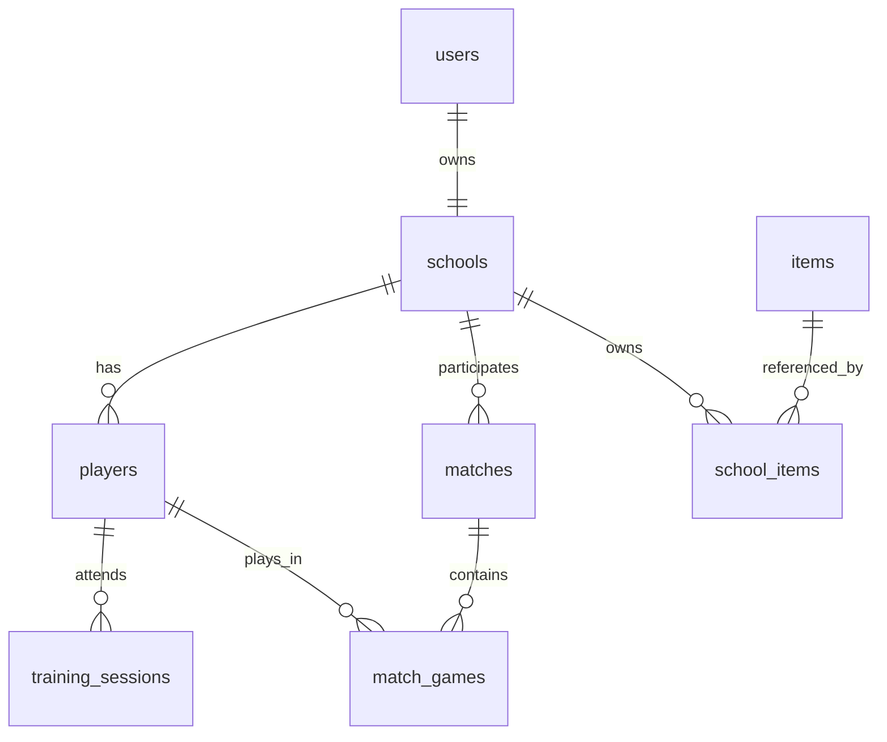

# ポケテニマスター 技術仕様書

## 1. システムアーキテクチャ

### 1.1 全体構成
```
┌─────────────────┐    ┌─────────────────┐    ┌─────────────────┐
│   Frontend      │    │   Backend       │    │   External      │
│   (Next.js)     │◄──►│   (Supabase)    │◄──►│   (PokeAPI)     │
└─────────────────┘    └─────────────────┘    └─────────────────┘
│                      │                      │
├─ App Router         ├─ PostgreSQL         ├─ Pokemon Data
├─ TypeScript         ├─ Auth               ├─ Images
├─ TailwindCSS        ├─ Real-time          └─ Sounds
├─ Zustand            ├─ Storage            
└─ Framer Motion     └─ Edge Functions     
```

### 1.2 技術スタック詳細

#### 1.2.1 フロントエンド
```typescript
{
  "framework": "Next.js 14.0+",
  "language": "TypeScript 5.0+",
  "styling": "TailwindCSS 3.3+",
  "stateManagement": "Zustand 4.4+",
  "animation": "Framer Motion 10.16+",
  "forms": "React Hook Form 7.47+",
  "validation": "Zod 3.22+",
  "icons": "Lucide React 0.290+",
  "components": "shadcn/ui (Radix UI base)"
}
```

#### 1.2.2 バックエンド
```typescript
{
  "database": "Supabase (PostgreSQL 15+)",
  "authentication": "Supabase Auth + Custom",
  "realtime": "Supabase Realtime",
  "storage": "Supabase Storage",
  "api": "Next.js API Routes + Supabase",
  "orm": "Supabase JavaScript Client"
}
```

#### 1.2.3 外部サービス
```typescript
{
  "pokemonData": "PokeAPI v2",
  "deployment": "Vercel",
  "cdn": "Vercel Edge Network",
  "monitoring": "Vercel Analytics",
  "domain": "Custom Domain (Optional)"
}
```

## 2. データベース設計

### 2.1 ERD概要


### 2.2 テーブル設計

#### 2.2.1 ユーザー・学校関連
```sql
-- ユーザーテーブル
CREATE TABLE users (
  id UUID PRIMARY KEY DEFAULT gen_random_uuid(),
  username VARCHAR(50) NOT NULL UNIQUE,
  fruits JSONB NOT NULL CHECK (jsonb_array_length(fruits) = 4),
  avatar_config JSONB DEFAULT '{}',
  created_at TIMESTAMP WITH TIME ZONE DEFAULT NOW(),
  updated_at TIMESTAMP WITH TIME ZONE DEFAULT NOW(),
  
  -- インデックス
  CONSTRAINT valid_username CHECK (LENGTH(username) >= 3),
  CONSTRAINT valid_fruits CHECK (fruits ? 'selection' AND fruits ? 'order')
);

-- 学校テーブル  
CREATE TABLE schools (
  id UUID PRIMARY KEY DEFAULT gen_random_uuid(),
  user_id UUID REFERENCES users(id) ON DELETE CASCADE,
  name VARCHAR(100) NOT NULL,
  
  -- ゲーム進行
  current_year INTEGER DEFAULT 1 CHECK (current_year BETWEEN 1 AND 3),
  current_month INTEGER DEFAULT 4 CHECK (current_month BETWEEN 1 AND 12),
  current_day INTEGER DEFAULT 1 CHECK (current_day BETWEEN 1 AND 31),
  game_speed VARCHAR(10) DEFAULT 'normal' CHECK (game_speed IN ('pause', 'normal', 'fast')),
  
  -- 学校ステータス
  reputation INTEGER DEFAULT 0 CHECK (reputation >= 0),
  funds INTEGER DEFAULT 100000 CHECK (funds >= 0),
  
  -- 設備情報
  facilities JSONB DEFAULT '{
    "courts": {"count": 2, "quality": 1, "surface": "concrete", "maintenance": 80},
    "equipment": {"ball_machine": false, "serve_machine": false, "video_analysis": false},
    "buildings": {"clubhouse": 1, "shower": false, "medical": false}
  }',
  
  created_at TIMESTAMP WITH TIME ZONE DEFAULT NOW(),
  updated_at TIMESTAMP WITH TIME ZONE DEFAULT NOW()
);

-- インデックス
CREATE INDEX idx_schools_user_id ON schools(user_id);
CREATE INDEX idx_schools_reputation ON schools(reputation DESC);
```

#### 2.2.2 選手関連
```sql
-- 選手テーブル
CREATE TABLE players (
  id UUID PRIMARY KEY DEFAULT gen_random_uuid(),
  school_id UUID REFERENCES schools(id) ON DELETE CASCADE,
  
  -- ポケモン情報
  pokemon_id INTEGER NOT NULL CHECK (pokemon_id > 0 AND pokemon_id <= 1010),
  pokemon_name VARCHAR(50) NOT NULL,
  pokemon_type_1 VARCHAR(20) NOT NULL,
  pokemon_type_2 VARCHAR(20),
  custom_name VARCHAR(50),
  
  -- 基本情報
  grade INTEGER NOT NULL CHECK (grade BETWEEN 1 AND 3),
  position VARCHAR(20) DEFAULT 'member' CHECK (position IN ('captain', 'vice_captain', 'regular', 'member')),
  join_date DATE NOT NULL,
  graduation_date DATE,
  
  -- 成長情報
  level INTEGER DEFAULT 1 CHECK (level BETWEEN 1 AND 100),
  experience INTEGER DEFAULT 0 CHECK (experience >= 0),
  evolution_stage INTEGER DEFAULT 0 CHECK (evolution_stage BETWEEN 0 AND 2),
  
  -- 基本能力値 (0-100)
  power INTEGER DEFAULT 50 CHECK (power BETWEEN 0 AND 100),
  technique INTEGER DEFAULT 50 CHECK (technique BETWEEN 0 AND 100),
  speed INTEGER DEFAULT 50 CHECK (speed BETWEEN 0 AND 100),
  stamina INTEGER DEFAULT 50 CHECK (stamina BETWEEN 0 AND 100),
  mental INTEGER DEFAULT 50 CHECK (mental BETWEEN 0 AND 100),
  
  -- テニス技術 (0-100)
  serve_skill INTEGER DEFAULT 30 CHECK (serve_skill BETWEEN 0 AND 100),
  volley_skill INTEGER DEFAULT 30 CHECK (volley_skill BETWEEN 0 AND 100),
  stroke_skill INTEGER DEFAULT 30 CHECK (stroke_skill BETWEEN 0 AND 100),
  return_skill INTEGER DEFAULT 30 CHECK (return_skill BETWEEN 0 AND 100),
  
  -- 戦術理解 (0-100)
  singles_aptitude INTEGER DEFAULT 50 CHECK (singles_aptitude BETWEEN 0 AND 100),
  doubles_aptitude INTEGER DEFAULT 50 CHECK (doubles_aptitude BETWEEN 0 AND 100),
  tactical_understanding INTEGER DEFAULT 30 CHECK (tactical_understanding BETWEEN 0 AND 100),
  
  -- 個体値 (0-31, ポケモンの遺伝的能力)
  iv_power INTEGER DEFAULT 15 CHECK (iv_power BETWEEN 0 AND 31),
  iv_technique INTEGER DEFAULT 15 CHECK (iv_technique BETWEEN 0 AND 31),
  iv_speed INTEGER DEFAULT 15 CHECK (iv_speed BETWEEN 0 AND 31),
  iv_stamina INTEGER DEFAULT 15 CHECK (iv_stamina BETWEEN 0 AND 31),
  iv_mental INTEGER DEFAULT 15 CHECK (iv_mental BETWEEN 0 AND 31),
  
  -- 努力値 (0-255, 練習による成長)
  ev_power INTEGER DEFAULT 0 CHECK (ev_power BETWEEN 0 AND 255),
  ev_technique INTEGER DEFAULT 0 CHECK (ev_technique BETWEEN 0 AND 255),
  ev_speed INTEGER DEFAULT 0 CHECK (ev_speed BETWEEN 0 AND 255),
  ev_stamina INTEGER DEFAULT 0 CHECK (ev_stamina BETWEEN 0 AND 255),
  ev_mental INTEGER DEFAULT 0 CHECK (ev_mental BETWEEN 0 AND 255),
  
  -- 性格・特性
  nature JSONB DEFAULT '{"name": "まじめ", "boost": null, "reduce": null}',
  ability JSONB DEFAULT '{"name": "通常", "description": "特に効果なし", "effects": {}}',
  hidden_ability JSONB,
  
  -- コンディション
  condition VARCHAR(20) DEFAULT 'normal' CHECK (condition IN ('excellent', 'good', 'normal', 'poor', 'terrible')),
  physical_fatigue INTEGER DEFAULT 0 CHECK (physical_fatigue BETWEEN 0 AND 100),
  mental_fatigue INTEGER DEFAULT 0 CHECK (mental_fatigue BETWEEN 0 AND 100),
  accumulated_fatigue INTEGER DEFAULT 0 CHECK (accumulated_fatigue BETWEEN 0 AND 100),
  motivation INTEGER DEFAULT 70 CHECK (motivation BETWEEN 0 AND 100),
  
  -- 習得技
  learned_moves JSONB DEFAULT '[]',
  move_slots INTEGER DEFAULT 4 CHECK (move_slots BETWEEN 1 AND 4),
  
  -- 統計情報
  matches_played INTEGER DEFAULT 0,
  matches_won INTEGER DEFAULT 0,
  sets_won INTEGER DEFAULT 0,
  sets_lost INTEGER DEFAULT 0,
  
  created_at TIMESTAMP WITH TIME ZONE DEFAULT NOW(),
  updated_at TIMESTAMP WITH TIME ZONE DEFAULT NOW(),
  
  -- 制約
  CONSTRAINT total_ev_limit CHECK (ev_power + ev_technique + ev_speed + ev_stamina + ev_mental <= 510),
  CONSTRAINT valid_graduation CHECK (graduation_date IS NULL OR graduation_date > join_date)
);

-- インデックス
CREATE INDEX idx_players_school_id ON players(school_id);
CREATE INDEX idx_players_pokemon_id ON players(pokemon_id);
CREATE INDEX idx_players_level ON players(level DESC);
CREATE INDEX idx_players_position ON players(position);
CREATE INDEX idx_players_grade ON players(grade);
```

#### 2.2.3 試合関連
```sql
-- 試合テーブル
CREATE TABLE matches (
  id UUID PRIMARY KEY DEFAULT gen_random_uuid(),
  
  -- 参加校
  home_school_id UUID REFERENCES schools(id) ON DELETE CASCADE,
  away_school_id UUID REFERENCES schools(id) ON DELETE CASCADE,
  
  -- 試合情報
  match_type VARCHAR(50) NOT NULL CHECK (match_type IN ('practice', 'prefecture_preliminary', 'prefecture_main', 'regional', 'national')),
  tournament_round VARCHAR(30) CHECK (tournament_round IN ('preliminary', 'first_round', 'second_round', 'quarterfinal', 'semifinal', 'final')),
  
  -- 環境設定
  court_type VARCHAR(20) NOT NULL DEFAULT 'hard' CHECK (court_type IN ('hard', 'clay', 'grass', 'indoor')),
  weather VARCHAR(20) DEFAULT 'clear' CHECK (weather IN ('clear', 'cloudy', 'rainy', 'windy', 'hot', 'cold')),
  temperature INTEGER CHECK (temperature BETWEEN -10 AND 45),
  
  -- 試合進行
  status VARCHAR(20) DEFAULT 'scheduled' CHECK (status IN ('scheduled', 'in_progress', 'completed', 'cancelled')),
  current_game INTEGER DEFAULT 1,
  home_wins INTEGER DEFAULT 0 CHECK (home_wins >= 0),
  away_wins INTEGER DEFAULT 0 CHECK (away_wins >= 0),
  
  -- 結果
  winner_school_id UUID REFERENCES schools(id),
  final_score VARCHAR(20), -- "3-2", "3-0" etc.
  
  -- ログ・詳細
  match_log JSONB DEFAULT '[]',
  statistics JSONB DEFAULT '{}',
  
  -- 日時
  scheduled_at TIMESTAMP WITH TIME ZONE NOT NULL,
  started_at TIMESTAMP WITH TIME ZONE,
  completed_at TIMESTAMP WITH TIME ZONE,
  created_at TIMESTAMP WITH TIME ZONE DEFAULT NOW(),
  
  -- 制約
  CONSTRAINT different_schools CHECK (home_school_id != away_school_id),
  CONSTRAINT valid_winner CHECK (winner_school_id IN (home_school_id, away_school_id) OR winner_school_id IS NULL),
  CONSTRAINT valid_completion CHECK (completed_at IS NULL OR completed_at >= started_at)
);

-- 個別ゲーム（シングルス・ダブルス）
CREATE TABLE match_games (
  id UUID PRIMARY KEY DEFAULT gen_random_uuid(),
  match_id UUID REFERENCES matches(id) ON DELETE CASCADE,
  
  -- ゲーム情報
  game_number INTEGER NOT NULL CHECK (game_number BETWEEN 1 AND 5), -- S1,S2,D1,S3,D2
  game_type VARCHAR(10) NOT NULL CHECK (game_type IN ('singles', 'doubles')),
  
  -- 参加選手 (UUID配列)
  home_players JSONB NOT NULL,
  away_players JSONB NOT NULL,
  
  -- 結果
  status VARCHAR(20) DEFAULT 'not_started' CHECK (status IN ('not_started', 'in_progress', 'completed')),
  home_sets INTEGER DEFAULT 0 CHECK (home_sets BETWEEN 0 AND 3),
  away_sets INTEGER DEFAULT 0 CHECK (away_sets BETWEEN 0 AND 3),
  winner VARCHAR(10) CHECK (winner IN ('home', 'away')),
  
  -- 詳細スコア [{"home": 6, "away": 4, "tiebreak": false}, ...]
  set_scores JSONB DEFAULT '[]',
  game_log JSONB DEFAULT '[]',
  
  -- 統計
  home_aces INTEGER DEFAULT 0,
  away_aces INTEGER DEFAULT 0,
  home_unforced_errors INTEGER DEFAULT 0,
  away_unforced_errors INTEGER DEFAULT 0,
  home_winners INTEGER DEFAULT 0,
  away_winners INTEGER DEFAULT 0,
  
  created_at TIMESTAMP WITH TIME ZONE DEFAULT NOW(),
  
  -- 制約
  CONSTRAINT valid_game_type_players CHECK (
    (game_type = 'singles' AND jsonb_array_length(home_players) = 1 AND jsonb_array_length(away_players) = 1) OR
    (game_type = 'doubles' AND jsonb_array_length(home_players) = 2 AND jsonb_array_length(away_players) = 2)
  ),
  CONSTRAINT valid_set_count CHECK (home_sets + away_sets <= 5)
);

-- インデックス
CREATE INDEX idx_matches_home_school ON matches(home_school_id);
CREATE INDEX idx_matches_away_school ON matches(away_school_id);
CREATE INDEX idx_matches_type_status ON matches(match_type, status);
CREATE INDEX idx_matches_scheduled_at ON matches(scheduled_at);
CREATE INDEX idx_match_games_match_id ON match_games(match_id);
```

#### 2.2.4 練習・育成関連
```sql
-- 練習セッション
CREATE TABLE training_sessions (
  id UUID PRIMARY KEY DEFAULT gen_random_uuid(),
  school_id UUID REFERENCES schools(id) ON DELETE CASCADE,
  
  -- 練習情報
  training_date DATE NOT NULL,
  session_type VARCHAR(50) NOT NULL CHECK (session_type IN (
    'basic_power', 'basic_technique', 'basic_speed', 'basic_stamina', 'basic_mental',
    'serve_training', 'volley_training', 'stroke_training', 'return_training',
    'singles_strategy', 'doubles_strategy', 'tactical_analysis',
    'physical_conditioning', 'mental_training', 'team_building'
  )),
  
  -- 練習設定
  intensity VARCHAR(10) NOT NULL DEFAULT 'normal' CHECK (intensity IN ('light', 'normal', 'hard', 'extreme')),
  duration INTEGER NOT NULL CHECK (duration BETWEEN 1 AND 8), -- 時間
  
  -- 参加者と結果
  participants JSONB NOT NULL, -- [{player_id, stat_gains, exp_gained, fatigue_gained}, ...]
  
  -- 練習メニュー詳細
  training_menu JSONB NOT NULL DEFAULT '{}',
  
  -- 特殊イベント
  special_events JSONB DEFAULT '[]', -- ランダムイベント記録
  
  -- 効果
  base_effectiveness DECIMAL(3,2) DEFAULT 1.0 CHECK (base_effectiveness BETWEEN 0.1 AND 3.0),
  weather_modifier DECIMAL(3,2) DEFAULT 1.0,
  facility_modifier DECIMAL(3,2) DEFAULT 1.0,
  
  created_at TIMESTAMP WITH TIME ZONE DEFAULT NOW(),
  
  -- 制約
  CONSTRAINT valid_participants CHECK (jsonb_array_length(participants) > 0)
);

-- 練習記録詳細（個別選手）
CREATE TABLE training_records (
  id UUID PRIMARY KEY DEFAULT gen_random_uuid(),
  training_session_id UUID REFERENCES training_sessions(id) ON DELETE CASCADE,
  player_id UUID REFERENCES players(id) ON DELETE CASCADE,
  
  -- 練習前後の変化
  stat_changes JSONB NOT NULL DEFAULT '{}', -- {power: +2, technique: +1, ...}
  experience_gained INTEGER DEFAULT 0 CHECK (experience_gained >= 0),
  fatigue_gained INTEGER DEFAULT 0 CHECK (fatigue_gained >= 0),
  
  -- 練習評価
  performance_rating VARCHAR(20) DEFAULT 'normal' CHECK (performance_rating IN ('terrible', 'poor', 'normal', 'good', 'excellent', 'perfect')),
  motivation_change INTEGER DEFAULT 0 CHECK (motivation_change BETWEEN -20 AND 20),
  
  -- 特殊効果
  special_gains JSONB DEFAULT '{}', -- 新技習得、特性獲得など
  
  created_at TIMESTAMP WITH TIME ZONE DEFAULT NOW()
);

-- インデックス
CREATE INDEX idx_training_sessions_school_date ON training_sessions(school_id, training_date);
CREATE INDEX idx_training_sessions_type ON training_sessions(session_type);
CREATE INDEX idx_training_records_player ON training_records(player_id);
CREATE INDEX idx_training_records_session ON training_records(training_session_id);
```

#### 2.2.5 アイテム・設備関連
```sql
-- アイテムマスタ
CREATE TABLE items (
  id UUID PRIMARY KEY DEFAULT gen_random_uuid(),
  name VARCHAR(100) NOT NULL UNIQUE,
  description TEXT,
  category VARCHAR(50) NOT NULL CHECK (category IN ('equipment', 'consumable', 'evolution', 'facility', 'special')),
  subcategory VARCHAR(50),
  
  -- 効果
  effects JSONB DEFAULT '{}',
  usage_type VARCHAR(20) DEFAULT 'permanent' CHECK (usage_type IN ('permanent', 'consumable', 'training_only')),
  
  -- 入手・コスト
  rarity VARCHAR(20) DEFAULT 'common' CHECK (rarity IN ('common', 'uncommon', 'rare', 'epic', 'legendary')),
  base_cost INTEGER CHECK (base_cost >= 0),
  unlock_requirements JSONB DEFAULT '{}',
  
  -- メタ情報
  is_active BOOLEAN DEFAULT true,
  created_at TIMESTAMP WITH TIME ZONE DEFAULT NOW()
);

-- 学校所有アイテム
CREATE TABLE school_items (
  id UUID PRIMARY KEY DEFAULT gen_random_uuid(),
  school_id UUID REFERENCES schools(id) ON DELETE CASCADE,
  item_id UUID REFERENCES items(id) ON DELETE CASCADE,
  
  quantity INTEGER DEFAULT 1 CHECK (quantity >= 0),
  condition_percentage INTEGER DEFAULT 100 CHECK (condition_percentage BETWEEN 0 AND 100), -- 耐久度
  purchase_date DATE DEFAULT CURRENT_DATE,
  last_maintenance DATE,
  
  -- アイテム固有データ
  item_data JSONB DEFAULT '{}',
  
  created_at TIMESTAMP WITH TIME ZONE DEFAULT NOW(),
  
  -- 制約
  UNIQUE(school_id, item_id) -- 同じアイテムは統合管理
);

-- インデックス
CREATE INDEX idx_items_category ON items(category, rarity);
CREATE INDEX idx_school_items_school ON school_items(school_id);
CREATE INDEX idx_school_items_item ON school_items(item_id);
```

#### 2.2.6 イベント・ストーリー関連
```sql
-- ストーリー進行
CREATE TABLE story_progress (
  id UUID PRIMARY KEY DEFAULT gen_random_uuid(),
  school_id UUID REFERENCES schools(id) ON DELETE CASCADE,
  
  -- ストーリー情報
  story_type VARCHAR(30) NOT NULL CHECK (story_type IN ('main', 'sub', 'player', 'seasonal', 'random')),
  chapter VARCHAR(50) NOT NULL,
  section VARCHAR(50) NOT NULL,
  event_id VARCHAR(100) NOT NULL, -- 'year1_summer_first_tournament'
  
  -- 進行状況
  status VARCHAR(20) DEFAULT 'available' CHECK (status IN ('locked', 'available', 'in_progress', 'completed')),
  completion_percentage INTEGER DEFAULT 0 CHECK (completion_percentage BETWEEN 0 AND 100),
  
  -- イベントデータ
  event_data JSONB DEFAULT '{}',
  player_choices JSONB DEFAULT '[]', -- プレイヤーの選択記録
  outcomes JSONB DEFAULT '{}', -- イベント結果
  
  -- 日時
  started_at TIMESTAMP WITH TIME ZONE,
  completed_at TIMESTAMP WITH TIME ZONE,
  created_at TIMESTAMP WITH TIME ZONE DEFAULT NOW(),
  
  -- 制約
  UNIQUE(school_id, event_id)
);

-- 実績・成果
CREATE TABLE achievements (
  id UUID PRIMARY KEY DEFAULT gen_random_uuid(),
  school_id UUID REFERENCES schools(id) ON DELETE CASCADE,
  
  -- 実績情報
  achievement_type VARCHAR(100) NOT NULL,
  achievement_id VARCHAR(100) NOT NULL, -- 'first_tournament_win', 'perfect_season'
  title VARCHAR(200) NOT NULL,
  description TEXT,
  
  -- 実績データ
  category VARCHAR(50) NOT NULL CHECK (category IN ('tournament', 'training', 'player_development', 'collection', 'special')),
  difficulty VARCHAR(20) DEFAULT 'normal' CHECK (difficulty IN ('easy', 'normal', 'hard', 'extreme', 'legendary')),
  
  -- 進捗・条件
  requirements JSONB NOT NULL DEFAULT '{}',
  current_progress JSONB DEFAULT '{}',
  is_completed BOOLEAN DEFAULT false,
  is_hidden BOOLEAN DEFAULT false, -- 隠し実績
  
  -- 報酬
  rewards JSONB DEFAULT '{}', -- {funds: 10000, items: [...], special_unlocks: [...]}
  
  unlocked_at TIMESTAMP WITH TIME ZONE DEFAULT NOW(),
  completed_at TIMESTAMP WITH TIME ZONE,
  
  -- 制約
  UNIQUE(school_id, achievement_id)
);

-- インデックス
CREATE INDEX idx_story_progress_school ON story_progress(school_id);
CREATE INDEX idx_story_progress_status ON story_progress(status);
CREATE INDEX idx_achievements_school ON achievements(school_id);
CREATE INDEX idx_achievements_category ON achievements(category, difficulty);
```

#### 2.2.7 ランキング・マルチプレイヤー関連
```sql
-- ランキング・リーグ
CREATE TABLE rankings (
  id UUID PRIMARY KEY DEFAULT gen_random_uuid(),
  
  -- シーズン情報
  season VARCHAR(50) NOT NULL, -- '2024-spring', '2024-summer'
  ranking_type VARCHAR(50) NOT NULL CHECK (ranking_type IN ('team_power', 'tournament_results', 'coaching_skill', 'collection')),
  
  -- リーグ・ランク
  league_tier VARCHAR(20) NOT NULL CHECK (league_tier IN ('bronze', 'silver', 'gold', 'platinum', 'diamond', 'master')),
  
  -- 学校情報
  school_id UUID REFERENCES schools(id) ON DELETE CASCADE,
  rank_position INTEGER NOT NULL CHECK (rank_position > 0),
  
  -- ポイント・スコア
  total_points INTEGER DEFAULT 0,
  tier_points INTEGER DEFAULT 0, -- リーグ内でのポイント
  
  -- 戦績
  matches_played INTEGER DEFAULT 0,
  matches_won INTEGER DEFAULT 0,
  win_rate DECIMAL(5,2) DEFAULT 0.0,
  
  -- メタ情報
  peak_rank INTEGER, -- そのシーズンでの最高順位
  previous_rank INTEGER, -- 前回の順位
  rank_change INTEGER DEFAULT 0, -- 順位変動
  
  last_updated TIMESTAMP WITH TIME ZONE DEFAULT NOW(),
  created_at TIMESTAMP WITH TIME ZONE DEFAULT NOW(),
  
  -- 制約
  UNIQUE(season, ranking_type, school_id),
  CONSTRAINT valid_win_rate CHECK (win_rate BETWEEN 0.0 AND 100.0)
);

-- 対戦履歴（マルチプレイヤー）
CREATE TABLE multiplayer_battles (
  id UUID PRIMARY KEY DEFAULT gen_random_uuid(),
  
  -- 対戦校
  challenger_school_id UUID REFERENCES schools(id) ON DELETE CASCADE,
  opponent_school_id UUID REFERENCES schools(id) ON DELETE CASCADE,
  
  -- バトル情報
  battle_type VARCHAR(30) DEFAULT 'ranked' CHECK (battle_type IN ('ranked', 'friendly', 'tournament')),
  format VARCHAR(20) DEFAULT 'team' CHECK (format IN ('singles', 'doubles', 'team')),
  
  -- 結果
  status VARCHAR(20) DEFAULT 'completed' CHECK (status IN ('in_progress', 'completed', 'cancelled')),
  winner_school_id UUID REFERENCES schools(id),
  final_score VARCHAR(20),
  
  -- データ（非同期バトル用）
  challenger_team_snapshot JSONB NOT NULL, -- バトル時点のチーム状態
  opponent_team_snapshot JSONB NOT NULL,
  battle_simulation_data JSONB DEFAULT '{}',
  detailed_log JSONB DEFAULT '[]',
  
  -- ランク・ポイント変動
  challenger_rank_change INTEGER DEFAULT 0,
  opponent_rank_change INTEGER DEFAULT 0,
  points_exchanged INTEGER DEFAULT 0,
  
  -- 日時
  battle_date TIMESTAMP WITH TIME ZONE DEFAULT NOW(),
  
  -- 制約
  CONSTRAINT different_schools_mp CHECK (challenger_school_id != opponent_school_id),
  CONSTRAINT valid_winner_mp CHECK (winner_school_id IN (challenger_school_id, opponent_school_id) OR winner_school_id IS NULL)
);

-- インデックス
CREATE INDEX idx_rankings_season_type ON rankings(season, ranking_type);
CREATE INDEX idx_rankings_league_rank ON rankings(league_tier, rank_position);
CREATE INDEX idx_rankings_school ON rankings(school_id);
CREATE INDEX idx_mp_battles_challenger ON multiplayer_battles(challenger_school_id);
CREATE INDEX idx_mp_battles_opponent ON multiplayer_battles(opponent_school_id);
CREATE INDEX idx_mp_battles_date ON multiplayer_battles(battle_date DESC);
```

### 2.3 データベース設定

#### 2.3.1 Row Level Security (RLS)
```sql
-- ユーザーは自分のデータのみアクセス可能
ALTER TABLE schools ENABLE ROW LEVEL SECURITY;
CREATE POLICY "Users can only access their own schools" ON schools
  FOR ALL USING (auth.uid()::text = (SELECT user_id::text FROM users WHERE id = user_id));

-- 選手データの保護
ALTER TABLE players ENABLE ROW LEVEL SECURITY;
CREATE POLICY "Users can only access their own players" ON players
  FOR ALL USING (school_id IN (SELECT id FROM schools WHERE user_id = auth.uid()));

-- 試合データは参加校のみアクセス可能
ALTER TABLE matches ENABLE ROW LEVEL SECURITY;
CREATE POLICY "Schools can access their own matches" ON matches
  FOR ALL USING (
    home_school_id IN (SELECT id FROM schools WHERE user_id = auth.uid()) OR
    away_school_id IN (SELECT id FROM schools WHERE user_id = auth.uid())
  );
```

#### 2.3.2 トリガー・関数
```sql
-- 自動更新トリガー
CREATE OR REPLACE FUNCTION update_updated_at_column()
RETURNS TRIGGER AS $$
BEGIN
  NEW.updated_at = NOW();
  RETURN NEW;
END;
$$ language 'plpgsql';

CREATE TRIGGER update_schools_updated_at BEFORE UPDATE ON schools
  FOR EACH ROW EXECUTE FUNCTION update_updated_at_column();
  
CREATE TRIGGER update_players_updated_at BEFORE UPDATE ON players
  FOR EACH ROW EXECUTE FUNCTION update_updated_at_column();

-- 選手統計自動計算
CREATE OR REPLACE FUNCTION update_player_statistics()
RETURNS TRIGGER AS $$
BEGIN
  -- 試合統計の更新ロジック
  UPDATE players SET 
    matches_played = (
      SELECT COUNT(*) FROM match_games mg 
      WHERE mg.home_players @> jsonb_build_array(NEW.player_id::text) 
         OR mg.away_players @> jsonb_build_array(NEW.player_id::text)
    ),
    matches_won = (
      SELECT COUNT(*) FROM match_games mg 
      WHERE (mg.home_players @> jsonb_build_array(NEW.player_id::text) AND mg.winner = 'home')
         OR (mg.away_players @> jsonb_build_array(NEW.player_id::text) AND mg.winner = 'away')
    )
  WHERE id = NEW.player_id;
  
  RETURN NEW;
END;
$$ language 'plpgsql';
```

## 3. API設計

### 3.1 RESTful API エンドポイント

#### 3.1.1 認証関連
```typescript
// POST /api/auth/login
interface LoginRequest {
  username: string;
  fruitSignature: string; // ハッシュ化された果物の組み合わせ
}

interface LoginResponse {
  success: boolean;
  user?: {
    id: string;
    username: string;
    avatarConfig: AvatarConfig;
  };
  token?: string;
  error?: string;
}

// POST /api/auth/register  
interface RegisterRequest {
  username: string;
  selectedFruits: Fruit[];
}

interface RegisterResponse {
  success: boolean;
  user?: {
    id: string;
    username: string;
    fruitSignature: string;
    avatarConfig: AvatarConfig;
  };
  error?: string;
}
```

#### 3.1.2 学校・チーム管理
```typescript
// GET /api/schools/[id]
interface SchoolResponse {
  id: string;
  name: string;
  currentYear: number;
  currentMonth: number;
  reputation: number;
  funds: number;
  facilities: FacilityData;
  players: Player[];
}

// PUT /api/schools/[id]
interface UpdateSchoolRequest {
  name?: string;
  facilities?: Partial<FacilityData>;
}

// POST /api/schools/[id]/advance-time
interface AdvanceTimeRequest {
  days: number;
  speed: 'normal' | 'fast';
}
```

#### 3.1.3 選手管理
```typescript
// GET /api/players
interface PlayersListResponse {
  players: Player[];
  totalCount: number;
  pagination: PaginationInfo;
}

// POST /api/players
interface CreatePlayerRequest {
  pokemonId: number;
  customName?: string;
  grade: 1 | 2 | 3;
}

// PUT /api/players/[id]
interface UpdatePlayerRequest {
  customName?: string;
  position?: PlayerPosition;
  trainingFocus?: TrainingFocus;
}

// POST /api/players/[id]/evolve
interface EvolvePlayerRequest {
  evolutionStage: number;
  useItem?: string;
}
```

#### 3.1.4 練習・トレーニング
```typescript
// POST /api/training/execute
interface ExecuteTrainingRequest {
  sessionType: TrainingType;
  participants: string[]; // player IDs
  intensity: 'light' | 'normal' | 'hard';
  duration: number;
}

interface ExecuteTrainingResponse {
  success: boolean;
  results: {
    playerId: string;
    statChanges: StatChanges;
    experienceGained: number;
    fatigueGained: number;
    specialEvents: SpecialEvent[];
  }[];
  schoolFundsChanged: number;
}

// GET /api/training/history
interface TrainingHistoryResponse {
  sessions: TrainingSession[];
  statistics: TrainingStatistics;
}
```

#### 3.1.5 試合システム
```typescript
// POST /api/matches/simulate
interface SimulateMatchRequest {
  opponentSchoolId: string;
  matchType: MatchType;
  teamFormation: TeamFormation;
}

interface SimulateMatchResponse {
  matchId: string;
  result: {
    winner: 'home' | 'away';
    finalScore: string;
    gameResults: GameResult[];
    statistics: MatchStatistics;
    experienceGained: PlayerExperience[];
    rewards: MatchRewards;
  };
}

// GET /api/matches/[id]
interface MatchDetailResponse {
  match: Match;
  games: MatchGame[];
  detailedLog: MatchLogEntry[];
  statistics: DetailedStatistics;
}
```

#### 3.1.6 Pokemon API統合
```typescript
// GET /api/pokemon/[id]
interface PokemonDataResponse {
  id: number;
  name: string;
  types: string[];
  baseStats: BaseStats;
  abilities: Ability[];
  evolutionChain: EvolutionInfo[];
  sprites: SpriteUrls;
  cries: AudioUrls;
}

// GET /api/pokemon/search
interface PokemonSearchRequest {
  query?: string;
  type?: string;
  generation?: number;
  limit?: number;
  offset?: number;
}
```

### 3.2 リアルタイム機能 (Supabase Realtime)

#### 3.2.1 リアルタイム更新
```typescript
// ランキング更新の購読
const subscription = supabase
  .channel('rankings')
  .on('postgres_changes', {
    event: 'UPDATE',
    schema: 'public',
    table: 'rankings'
  }, (payload) => {
    // ランキング変動をリアルタイム表示
    updateRankingDisplay(payload.new);
  })
  .subscribe();

// マルチプレイヤー対戦結果の購読
const battleSubscription = supabase
  .channel('battles')
  .on('postgres_changes', {
    event: 'INSERT',
    schema: 'public',
    table: 'multiplayer_battles',
    filter: `challenger_school_id=eq.${schoolId}`
  }, (payload) => {
    // 対戦結果通知
    showBattleResult(payload.new);
  })
  .subscribe();
```

## 4. フロントエンド アーキテクチャ

### 4.1 状態管理 (Zustand)

#### 4.1.1 認証ストア
```typescript
interface AuthState {
  user: User | null;
  school: School | null;
  isLoading: boolean;
  error: string | null;
}

interface AuthActions {
  login: (credentials: LoginCredentials) => Promise<void>;
  logout: () => void;
  register: (data: RegisterData) => Promise<void>;
  loadUserData: () => Promise<void>;
}

export const useAuthStore = create<AuthState & AuthActions>((set, get) => ({
  user: null,
  school: null,
  isLoading: false,
  error: null,
  
  login: async (credentials) => {
    set({ isLoading: true, error: null });
    try {
      const response = await authAPI.login(credentials);
      set({ user: response.user, isLoading: false });
      await get().loadUserData();
    } catch (error) {
      set({ error: error.message, isLoading: false });
    }
  },
  
  // ... その他のアクション
}));
```

#### 4.1.2 ゲーム状態ストア
```typescript
interface GameState {
  currentDate: Date;
  gameSpeed: GameSpeed;
  actionPointsRemaining: number;
  isProcessing: boolean;
}

interface GameActions {
  advanceTime: (days: number) => Promise<void>;
  executeAction: (action: GameAction) => Promise<void>;
  setGameSpeed: (speed: GameSpeed) => void;
}

export const useGameStore = create<GameState & GameActions>((set, get) => ({
  currentDate: new Date(),
  gameSpeed: 'normal',
  actionPointsRemaining: 6,
  isProcessing: false,
  
  advanceTime: async (days) => {
    set({ isProcessing: true });
    try {
      await gameAPI.advanceTime(days);
      // 時間経過処理、イベント発生チェック等
      set({ 
        currentDate: addDays(get().currentDate, days),
        actionPointsRemaining: 6,
        isProcessing: false 
      });
    } catch (error) {
      set({ isProcessing: false });
      throw error;
    }
  },
  
  // ... その他のアクション
}));
```

#### 4.1.3 選手管理ストア
```typescript
interface PlayerState {
  players: Player[];
  selectedPlayer: Player | null;
  isLoading: boolean;
  filterCriteria: PlayerFilterCriteria;
}

interface PlayerActions {
  loadPlayers: () => Promise<void>;
  selectPlayer: (playerId: string) => void;
  updatePlayer: (playerId: string, updates: PlayerUpdates) => Promise<void>;
  trainPlayers: (playerIds: string[], training: TrainingConfig) => Promise<void>;
  evolvePlayer: (playerId: string, evolutionData: EvolutionData) => Promise<void>;
}

export const usePlayerStore = create<PlayerState & PlayerActions>((set, get) => ({
  players: [],
  selectedPlayer: null,
  isLoading: false,
  filterCriteria: { grade: 'all', position: 'all', type: 'all' },
  
  loadPlayers: async () => {
    set({ isLoading: true });
    const players = await playerAPI.getPlayers();
    set({ players, isLoading: false });
  },
  
  trainPlayers: async (playerIds, training) => {
    const result = await trainingAPI.execute({
      participants: playerIds,
      ...training
    });
    
    // 選手ステータス更新
    const updatedPlayers = get().players.map(player => {
      const result = trainingResult.find(r => r.playerId === player.id);
      return result ? { ...player, ...result.changes } : player;
    });
    
    set({ players: updatedPlayers });
  },
  
  // ... その他のアクション
}));
```

### 4.2 コンポーネント設計

#### 4.2.1 ページ構成
```typescript
// app/game/page.tsx - メインゲーム画面
export default function GameDashboard() {
  return (
    <GameLayout>
      <div className="grid grid-cols-12 gap-6 h-screen">
        <aside className="col-span-3">
          <SchoolInfoPanel />
          <QuickActionsPanel />
        </aside>
        
        <main className="col-span-6">
          <TimeControls />
          <CurrentEventDisplay />
          <MainContentArea />
        </main>
        
        <aside className="col-span-3">
          <PlayerStatusPanel />
          <UpcomingEventsPanel />
        </aside>
      </div>
    </GameLayout>
  );
}

// app/game/team/page.tsx - チーム管理画面
export default function TeamManagement() {
  return (
    <GameLayout>
      <div className="space-y-6">
        <TeamOverview />
        <PlayerGrid />
        <FormationEditor />
      </div>
    </GameLayout>
  );
}
```

#### 4.2.2 共通コンポーネント
```typescript
// components/game/PlayerCard.tsx
interface PlayerCardProps {
  player: Player;
  showDetails?: boolean;
  onSelect?: (player: Player) => void;
  onAction?: (action: PlayerAction) => void;
}

export function PlayerCard({ player, showDetails, onSelect, onAction }: PlayerCardProps) {
  return (
    <Card className="relative overflow-hidden hover:shadow-lg transition-shadow">
      <CardHeader className="pb-2">
        <div className="flex items-center space-x-3">
          <PokemonAvatar pokemonId={player.pokemonId} size="sm" />
          <div>
            <h3 className="font-semibold">{player.customName || player.pokemonName}</h3>
            <p className="text-sm text-muted-foreground">
              {player.grade}年生 | Lv.{player.level}
            </p>
          </div>
        </div>
      </CardHeader>
      
      {showDetails && (
        <CardContent>
          <StatBars stats={player.stats} />
          <TennisSkillBars skills={player.tennisSkills} />
          <ConditionIndicator condition={player.condition} />
        </CardContent>
      )}
      
      <CardFooter className="pt-2">
        <ActionButtons player={player} onAction={onAction} />
      </CardFooter>
    </Card>
  );
}

// components/game/StatBars.tsx
interface StatBarsProps {
  stats: PlayerStats;
  maxValue?: number;
  showValues?: boolean;
}

export function StatBars({ stats, maxValue = 100, showValues = true }: StatBarsProps) {
  const statEntries = Object.entries(stats);
  
  return (
    <div className="space-y-2">
      {statEntries.map(([statName, value]) => (
        <div key={statName} className="flex items-center space-x-2">
          <span className="text-sm font-medium min-w-[80px]">
            {getStatDisplayName(statName)}
          </span>
          <div className="flex-1">
            <Progress 
              value={(value / maxValue) * 100} 
              className="h-2"
              color={getStatColor(statName)}
            />
          </div>
          {showValues && (
            <span className="text-sm text-muted-foreground min-w-[40px] text-right">
              {value}
            </span>
          )}
        </div>
      ))}
    </div>
  );
}
```

### 4.3 ゲームエンジン実装

#### 4.3.1 バトル計算エンジン
```typescript
// lib/game-engine/battle-calculator.ts
export class BattleCalculator {
  static calculateMatchOutcome(
    homePlayer: Player,
    awayPlayer: Player,
    conditions: MatchConditions
  ): MatchResult {
    // 基本能力値比較
    const statAdvantage = this.calculateStatAdvantage(homePlayer, awayPlayer);
    
    // タイプ相性計算
    const typeEffectiveness = this.calculateTypeMatchup(
      homePlayer.pokemonType1,
      homePlayer.pokemonType2,
      awayPlayer.pokemonType1,
      awayPlayer.pokemonType2
    );
    
    // 戦術相性
    const tacticalAdvantage = this.calculateTacticalMatchup(
      homePlayer.playStyle,
      awayPlayer.playStyle
    );
    
    // 環境要因
    const environmentBonus = this.calculateEnvironmentEffect(
      conditions,
      homePlayer,
      awayPlayer
    );
    
    // 最終勝率計算
    const winProbability = this.combineFactors({
      statAdvantage,
      typeEffectiveness,
      tacticalAdvantage,
      environmentBonus
    });
    
    return this.simulateMatch(homePlayer, awayPlayer, winProbability);
  }
  
  private static calculateTypeMatchup(
    type1a: PokemonType,
    type2a: PokemonType | null,
    type1b: PokemonType,
    type2b: PokemonType | null
  ): number {
    // ポケモンのタイプ相性表を使用
    const effectiveness1 = TYPE_CHART[type1a]?.[type1b] || 1.0;
    const effectiveness2 = type2a ? (TYPE_CHART[type2a]?.[type1b] || 1.0) : 1.0;
    const effectiveness3 = TYPE_CHART[type1a]?.[type2b] || 1.0;
    const effectiveness4 = type2a && type2b ? (TYPE_CHART[type2a]?.[type2b] || 1.0) : 1.0;
    
    return (effectiveness1 + effectiveness2 + effectiveness3 + effectiveness4) / 4;
  }
  
  private static simulateMatch(
    homePlayer: Player,
    awayPlayer: Player,
    winProbability: number
  ): MatchResult {
    const sets: SetResult[] = [];
    let homeSets = 0;
    let awaySets = 0;
    
    // 最大5セットマッチ
    while (homeSets < 3 && awaySets < 3 && sets.length < 5) {
      const setResult = this.simulateSet(homePlayer, awayPlayer, winProbability);
      sets.push(setResult);
      
      if (setResult.winner === 'home') homeSets++;
      else awaySets++;
    }
    
    return {
      winner: homeSets > awaySets ? 'home' : 'away',
      finalScore: `${homeSets}-${awaySets}`,
      sets,
      statistics: this.calculateMatchStatistics(sets),
      duration: this.calculateMatchDuration(sets)
    };
  }
}
```

#### 4.3.2 トレーニングシステム
```typescript
// lib/game-engine/training-system.ts
export class TrainingSystem {
  static calculateTrainingEffect(
    player: Player,
    trainingType: TrainingType,
    conditions: TrainingConditions
  ): TrainingResult {
    // 基本効果値
    const baseEffect = TRAINING_BASE_EFFECTS[trainingType];
    
    // プレイヤー固有の補正
    const playerModifiers = this.calculatePlayerModifiers(player, trainingType);
    
    // 設備・環境補正
    const facilityBonus = this.calculateFacilityBonus(conditions.facilities, trainingType);
    const weatherEffect = this.calculateWeatherEffect(conditions.weather, trainingType);
    
    // ランダム要素（±20%のバリエーション）
    const randomFactor = 0.8 + Math.random() * 0.4;
    
    // 最終効果計算
    const finalEffect = baseEffect * 
      playerModifiers.typeBonus *
      playerModifiers.natureBonus *
      playerModifiers.conditionModifier *
      facilityBonus *
      weatherEffect *
      randomFactor;
    
    return {
      statGains: this.distributeStatGains(finalEffect, trainingType),
      experienceGained: Math.floor(finalEffect * 10),
      fatigueIncrease: this.calculateFatigue(trainingType, player.stamina),
      specialEvents: this.checkSpecialEvents(player, trainingType, finalEffect),
      motivationChange: this.calculateMotivationChange(player, trainingType, finalEffect)
    };
  }
  
  static checkEvolutionConditions(player: Player): EvolutionCheckResult {
    const evolutionData = EVOLUTION_DATA[player.pokemonId];
    if (!evolutionData || player.evolutionStage >= evolutionData.maxStages) {
      return { canEvolve: false };
    }
    
    const nextEvolution = evolutionData.stages[player.evolutionStage + 1];
    const conditions = nextEvolution.conditions;
    
    // レベルチェック
    if (conditions.level && player.level < conditions.level) {
      return { canEvolve: false, missingRequirement: 'level' };
    }
    
    // 友好度チェック
    if (conditions.friendship && player.friendship < conditions.friendship) {
      return { canEvolve: false, missingRequirement: 'friendship' };
    }
    
    // アイテムチェック
    if (conditions.item && !this.hasRequiredItem(player.schoolId, conditions.item)) {
      return { canEvolve: false, missingRequirement: 'item' };
    }
    
    // 特殊条件チェック
    if (conditions.special && !this.checkSpecialCondition(player, conditions.special)) {
      return { canEvolve: false, missingRequirement: 'special' };
    }
    
    return {
      canEvolve: true,
      nextForm: nextEvolution,
      requiredItem: conditions.item
    };
  }
}
```

## 5. デプロイメント・運用

### 5.1 Vercel設定
```javascript
// next.config.js
/** @type {import('next').NextConfig} */
const nextConfig = {
  experimental: {
    appDir: true,
  },
  images: {
    domains: [
      'raw.githubusercontent.com', // PokeAPI sprites
      'assets.pokemon.com',
      'supabase.co'
    ],
  },
  env: {
    CUSTOM_KEY: process.env.CUSTOM_KEY,
  },
  // パフォーマンス最適化
  swcMinify: true,
  compiler: {
    removeConsole: process.env.NODE_ENV === 'production',
  },
}

module.exports = nextConfig
```

### 5.2 環境変数管理
```bash
# .env.local
NEXT_PUBLIC_SUPABASE_URL=https://your-project.supabase.co
NEXT_PUBLIC_SUPABASE_ANON_KEY=your-anon-key
SUPABASE_SERVICE_ROLE_KEY=your-service-role-key

# Game Settings
NEXT_PUBLIC_GAME_VERSION=1.0.0
NEXT_PUBLIC_MAX_PLAYERS_PER_TEAM=15
NEXT_PUBLIC_DEBUG_MODE=false

# External APIs
NEXT_PUBLIC_POKEAPI_BASE_URL=https://pokeapi.co/api/v2
POKEMON_DATA_CACHE_TTL=86400

# Performance
NEXT_PUBLIC_ENABLE_ANALYTICS=true
```

### 5.3 パフォーマンス最適化

#### 5.3.1 画像最適化
```typescript
// lib/pokemon-image-loader.ts
export function pokemonImageLoader({ src, width, quality }: ImageLoaderProps) {
  // PokeAPI画像の最適化
  const baseUrl = 'https://raw.githubusercontent.com/PokeAPI/sprites/master/sprites/pokemon';
  
  // 高解像度画像のフオールバック
  if (width > 256) {
    return `${baseUrl}/other/official-artwork/${src}.png`;
  }
  
  return `${baseUrl}/${src}.png`;
}

// components/PokemonImage.tsx
export function PokemonImage({ pokemonId, size = 'md', ...props }) {
  const sizeMap = {
    sm: 64,
    md: 128,
    lg: 256,
    xl: 512
  };
  
  return (
    <Image
      src={pokemonId.toString()}
      alt={`Pokemon ${pokemonId}`}
      width={sizeMap[size]}
      height={sizeMap[size]}
      loader={pokemonImageLoader}
      loading="lazy"
      {...props}
    />
  );
}
```

#### 5.3.2 データキャッシュ戦略
```typescript
// lib/cache-manager.ts
export class CacheManager {
  private static cache = new Map<string, CacheEntry>();
  private static readonly CACHE_TTL = {
    pokemon_data: 24 * 60 * 60 * 1000, // 24時間
    match_results: 60 * 60 * 1000,     // 1時間
    rankings: 10 * 60 * 1000,          // 10分
    user_data: 5 * 60 * 1000           // 5分
  };
  
  static async get<T>(key: string, fallback: () => Promise<T>, ttl?: number): Promise<T> {
    const cached = this.cache.get(key);
    
    if (cached && Date.now() - cached.timestamp < (ttl || this.CACHE_TTL.pokemon_data)) {
      return cached.data as T;
    }
    
    const data = await fallback();
    this.cache.set(key, {
      data,
      timestamp: Date.now()
    });
    
    return data;
  }
  
  static invalidate(pattern: string) {
    for (const key of this.cache.keys()) {
      if (key.includes(pattern)) {
        this.cache.delete(key);
      }
    }
  }
}
```

---

## 6. セキュリティ・品質保証

### 6.1 セキュリティ対策
- Supabase RLS によるデータアクセス制御
- フロントエンドでの入力値検証（Zod）
- SQLインジェクション対策（Supabase prepared statements）
- XSS対策（Next.js built-in protection）
- 認証トークンの適切な管理

### 6.2 品質保証
- TypeScript による静的型チェック
- ESLint + Prettier によるコード品質維持
- Jest + Testing Library によるユニットテスト
- Vercel によるCI/CD自動化

**この技術仕様書に基づいて、堅牢で拡張性の高いポケテニマスターゲームを構築します。**